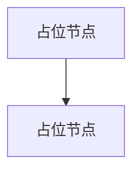
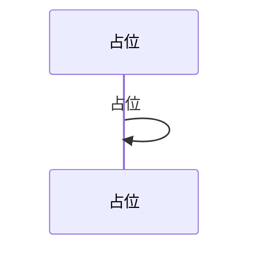
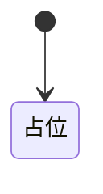

# <模块名> 流程图（Mermaid）

> **生成要求（来自原 example）**
> 优先完成[依赖关系](./依赖关系.md) [接口文档](./接口文档.md)，
> 并参考其中的文档以及提供的模块代码，生成流程图（Mermaid）。

## 主数据流

<!-- 每个节点对应真实函数/类，节点名用真实符号名；
     图下用锚点表逐条说明每个节点的证据来源 -->

| 节点 | 对应符号 | 锚点 |
|---|---|---|
| | | |

## 时序图（如涉及多线程 / 回调）

| 步骤 | 对应符号 | 锚点 |
|---|---|---|
| | | |

## 状态机（如模块内有 FSM）

| 状态/迁移 | 对应符号 | 锚点 |
|---|---|---|
| | | |
