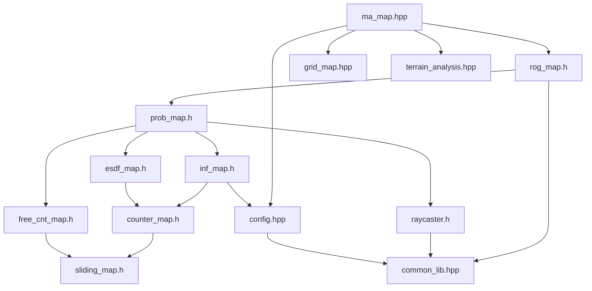

# map 模块 依赖关系

## CMake target 与链接依赖

| 项 | 值 | 锚点 |
|---|---|---|
| 工程名 / 库名 | `3d_occ_map` | `src/map/CMakeLists.txt:3` |
| 源文件收集 | `file(GLOB_RECURSE sources CONFIGURE_DEPENDS "src/*.cpp")` | `src/map/CMakeLists.txt:5` |
| target 类型 | 库（`add_library`） | `src/map/CMakeLists.txt:7` |
| sources | `target_sources(... PRIVATE ${sources})` | `src/map/CMakeLists.txt:9` |
| include 可见性 | `target_include_directories(... PUBLIC include)` | `src/map/CMakeLists.txt:11` |

`GLOB_RECURSE` + `CONFIGURE_DEPENDS` 意味着**新增 .cpp 会被自动纳入**，
不需要改 CMakeLists；同时也意味着「哪些文件属于本模块」由目录结构决定。

## 外部库依赖

| 库 | 用途 | 锚点 |
|---|---|---|
| `spdlog::spdlog` | 日志 | `src/map/CMakeLists.txt:14` |
| `${PCL_LIBRARIES}` | 点云与点云类型（PCL） | `src/map/CMakeLists.txt:16` |
| `Eigen3::Eigen` | 矩阵、向量、四元数 | `src/map/CMakeLists.txt:17` |
| `yaml-cpp::yaml-cpp` | YAML 参数解析（经 utils 模块的 YamlLoader） | `src/map/CMakeLists.txt:18` |

链接可见性为 `PRIVATE`（`src/map/CMakeLists.txt:13`），
即这些库不通过 `3d_occ_map` 向外传播。

PCL 类型在模块内的实际使用点是 `Config` 里的两个别名（`PclPoint`、`PointCloud`），
见 `src/map/include/map/3d_occ_map/config.hpp:46` 与
`src/map/include/map/3d_occ_map/config.hpp:47`。

## 模块内依赖

| 依赖方 | 被依赖 | 锚点 |
|---|---|---|
| `ma_map.hpp` | `3d_occ_map/rog_map.h` | `src/map/include/map/ma_map.hpp:2` |
| `ma_map.hpp` | `grid_map.hpp` | `src/map/include/map/ma_map.hpp:3` |
| `ma_map.hpp` | `3d_occ_map/config.hpp` | `src/map/include/map/ma_map.hpp:4` |
| `ma_map.hpp` | `terrain_analysis.hpp` | `src/map/include/map/ma_map.hpp:5` |
| `rog_map.h` | `prob_map.h` | `src/map/include/map/3d_occ_map/rog_map.h:26` |
| `rog_map.h` | `common_lib.hpp` | `src/map/include/map/3d_occ_map/rog_map.h:27` |
| `prob_map.h` | `inf_map.h` / `free_cnt_map.h` / `esdf_map.h` / `raycaster.h` | `src/map/include/map/3d_occ_map/prob_map.h:27-30` |
| `inf_map.h` | `counter_map.h` | `src/map/include/map/3d_occ_map/inf_map.h:27` |
| `esdf_map.h` | `counter_map.h` | `src/map/include/map/3d_occ_map/esdf_map.h:26` |
| `counter_map.h` | `sliding_map.h` | `src/map/include/map/3d_occ_map/counter_map.h:26` |
| `free_cnt_map.h` | `sliding_map.h` | `src/map/include/map/3d_occ_map/free_cnt_map.h:28` |
| `raycaster.h` | `common_lib.hpp` | `src/map/include/map/3d_occ_map/raycaster.h:31` |
| `terrain_analysis.hpp` | `3d_occ_map/rog_map.h` | `src/map/include/map/terrain_analysis.hpp:3` |
| `config.hpp` | `common_lib.hpp` | `src/map/include/map/3d_occ_map/config.hpp:27` |

【事实】`grid_map.hpp` 不依赖模块内任何其他头文件，只依赖 STL 与 Eigen
（`src/map/include/map/grid_map.hpp:27-31`），因此 2D 栅格可以独立复用。

## 跨模块依赖

### map 依赖谁

| 被依赖模块 | 依赖点 | 锚点 |
|---|---|---|
| utils | `utils/type_utils.hpp`（`Vec3f`、`GridType`、`RobotState` 等） | `src/map/include/map/3d_occ_map/counter_map.h:27` |
| utils | `utils/eigen_alias.hpp` | `src/map/include/map/3d_occ_map/sliding_map.h:28` |
| utils | `utils/logger.hpp` | `src/map/include/map/ma_map.hpp:6` |
| utils | `utils/scope_timer.hpp` | `src/map/include/map/3d_occ_map/sliding_map.h:27` |
| utils | `utils/yaml_loader.hpp`（参数读取） | `src/map/include/map/3d_occ_map/config.hpp:30` |

### 谁依赖 map

| 依赖方 | 依赖点 | 锚点 |
|---|---|---|
| ros2 | `map/ma_map.hpp` | `src/ros2/include/ros2/ros2_node.h:6` |
| ros2 | `map/grid_map.hpp`、`map/ma_map.hpp` | `src/ros2/include/ros2/misc/visualizer.hpp:2` |
| ros2 | `map/grid_map.hpp` | `src/ros2/src/ros2_node.cpp:3` |
| planner/path_planning | `map/grid_map.hpp`（A*） | `src/planner/path_planning/include/path_planning/search/astar.h:28` |
| planner/path_planning | `map/grid_map.hpp`（JPS） | `src/planner/path_planning/include/path_planning/search/jps.h:3` |
| planner/path_planning | `map/grid_map.hpp`（后处理） | `src/planner/path_planning/include/path_planning/post_processing.h:2` |
| planner/replan | `map/grid_map.hpp` | `src/planner/replan/include/replan/fsm_replanner.h:2` |
| planner/traj_optimize | `map/grid_map.hpp`（ESDF 接口） | `src/planner/traj_optimize/include/traj_optimize/grid_map_esdf.hpp:8` |

【事实】下游模块全部只依赖 `grid_map.hpp`（2D 栅格）与 `ma_map.hpp`（门面），
**没有**下游直接 include `3d_occ_map/*`。这意味着 `3d_occ_map` 的内部继承链
可以独立演进，对下游是封装的。

## 依赖风险

| # | 风险 | 说明 | 锚点 | 类型 |
|---|---|---|---|---|
| 1 | 门面与 3D 地图同头文件暴露 | `ma_map.hpp` 直接 include `3d_occ_map/rog_map.h`，下游取到门面后即可经其访问器触及全部 3D 内部接口 | `src/map/include/map/ma_map.hpp:2`、`src/map/include/map/ma_map.hpp:130` | 【事实】 |
| 2 | 无循环依赖 | 模块内 include 图是有向无环的（`sliding_map.h` 不反向依赖派生类） | `src/map/include/map/3d_occ_map/sliding_map.h:27` | 【事实】 |
| 3 | PCL 类型出现在 `Config` 中 | `rog_map::PclPoint` / `rog_map::PointCloud` 定义在 config.hpp，使参数头文件也拖入 PCL | `src/map/include/map/3d_occ_map/config.hpp:46`、`src/map/include/map/3d_occ_map/config.hpp:47` | 【事实】 |
| 4 | 固定原点与滑窗语义叠加 | `map_sliding` 为 true 同时 `fix_map_origin` 被显式配置（YAML 键 `map_sliding.enable`），两者叠加后的实际行为需实机确认 | `config/map.yaml:27`、`config/map.yaml:10` | 【待确认】 |
