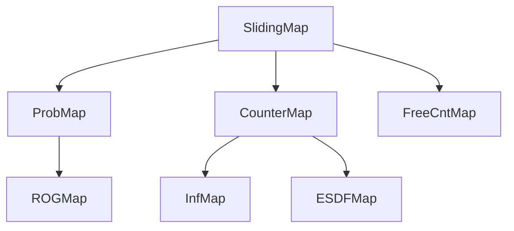
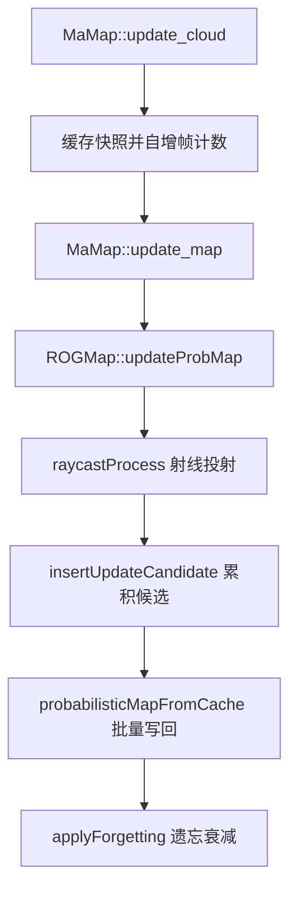

# map 模块设计说明

## 设计目标与约束

| # | 目标 / 约束 | 证据 |
|---|---|---|
| 1 | 在**局部**地图上做概率占据更新，靠滑窗把内存限制在有界范围 | `src/map/include/map/3d_occ_map/sliding_map.h:66` |
| 2 | 概率值不直接暴露给查询方，统一映射为 `GridType` 三态（占据/未知/已知自由） | `src/map/include/map/3d_occ_map/prob_map.h:67` |
| 3 | 膨胀地图用**独立分辨率**的计数地图实现，避免在概率地图上做膨胀 | `src/map/include/map/3d_occ_map/inf_map.h:31` |
| 4 | 前沿（frontier）判定用独立计数地图，而不是每次遍历概率地图 | `src/map/include/map/3d_occ_map/free_cnt_map.h:34` |
| 5 | 体素新增占据时通过计数器累积，达到批量阈值再统一写回概率地图 | `src/map/include/map/3d_occ_map/prob_map.h:133` |
| 6 | 2D 规划栅格与 3D 概率地图**分离**，边界按原点四向延伸量配置 | `src/map/include/map/grid_map.hpp:58` |

排列顺序说明：`ORIGIN_AT_CORNER` 策略下格心为位置、原点落在格角上，
边界约定写在 `src/map/include/map/3d_occ_map/sliding_map.h:32` 的注释图中。

## 类结构与协作关系

### 3D 概率地图继承链

| 类 | 角色 | 协作对象 | 锚点 |
|---|---|---|---|
| `rog_map::SlidingMap` | 局部地图基类：索引/哈希换算、滑窗、越界内存清理 | 无（抽象基类） | `src/map/include/map/3d_occ_map/sliding_map.h:43` |
| `rog_map::ProbMap` | 概率占据体素、射线投射更新、遗忘、批量写回 | 组合 `InfMap` / `FreeCntMap` / `ESDFMap` / `RayCaster` | `src/map/include/map/3d_occ_map/prob_map.h:35` |
| `rog_map::ROGMap` | 对外查询门面：线段可行、最近格搜索、机器人状态 | 继承 `ProbMap` | `src/map/include/map/3d_occ_map/rog_map.h:38` |
| `rog_map::CounterMap` | 子格计数基类：占据/未知计数、类型跳变回调 | 继承 `SlidingMap` | `src/map/include/map/3d_occ_map/counter_map.h:33` |
| `rog_map::InfMap` | 膨胀计数地图，按邻域占据数回答膨胀查询 | 继承 `CounterMap` | `src/map/include/map/3d_occ_map/inf_map.h:31` |
| `rog_map::ESDFMap` | 欧氏符号距离场与一/二阶梯度 | 继承 `CounterMap` | `src/map/include/map/3d_occ_map/esdf_map.h:35` |
| `rog_map::FreeCntMap` | 自由邻居计数，用于前沿判定 | 继承 `SlidingMap` | `src/map/include/map/3d_occ_map/free_cnt_map.h:34` |
| `rog_map::raycaster::RayCaster` | 体素遍历式射线投射 | 被 `ProbMap::raycast_data_` 持有 | `src/map/include/map/3d_occ_map/raycaster.h:55` |

### 门面与 2D 侧

| 类 | 角色 | 协作对象 | 锚点 |
|---|---|---|---|
| `ma_map::MaMap` | 模块门面：持有 3D 地图、2D 栅格、terrain 分析器 | 组合 `ROGMap` / `GridMap` / `TerrainAnalyzer` | `src/map/include/map/ma_map.hpp:10` |
| `grid_map::GridMap` | 2D 占据栅格 + 距离场 + 语义标记 | 被 `MaMap` 持有 | `src/map/include/map/grid_map.hpp:38` |
| `Terrain::TerrainAnalyzer` | 窗口内高度/间隙分析，输出障碍点 | 被 `MaMap` 持有 | `src/map/include/map/terrain_analysis.hpp:15` |
| `rog_map::Config` | 全部地图参数的载体 | 被 `ROGMap` / `ProbMap` / `InfMap` / `CounterMap` 持有 | `src/map/include/map/3d_occ_map/config.hpp:49` |

`MaMap` 的构造顺序是**先建 3D 地图、再建 2D 栅格**：`rog_map::ProbMap::setConfig` 与 `ROGMap::init`
在 `src/map/include/map/ma_map.hpp:17`、`src/map/include/map/ma_map.hpp:18`；
`GridMap::init` 在 `src/map/include/map/ma_map.hpp:29`；
terrain 配置从 `Config` 逐字段拷贝到 `TerrainAnalyzer::Config`，
见 `src/map/include/map/ma_map.hpp:20`。

## 数据流

### 3D 概率地图更新（每帧）

| 步骤 | 对应符号 | 锚点 |
|---|---|---|
| 1 点云入口 | `ma_map::MaMap::update_cloud` | `src/map/include/map/ma_map.hpp:102` |
| 2 里程计新鲜度过滤 | 比较时间戳与配置阈值 | `src/map/include/map/ma_map.hpp:109` |
| 3 帧计数自增 | 未完成帧计数 | `src/map/include/map/ma_map.hpp:116` |
| 4 地图更新入口 | `ma_map::MaMap::update_map` | `src/map/include/map/ma_map.hpp:50` |
| 5 概率更新 | `rog_map::ProbMap::updateProbMap` | `src/map/include/map/3d_occ_map/prob_map.h:109` |
| 6 射线投射 | `rog_map::ProbMap::raycastProcess` | `src/map/include/map/3d_occ_map/prob_map.h:186` |
| 7 候选累积 | `rog_map::ProbMap::insertUpdateCandidate` | `src/map/include/map/3d_occ_map/prob_map.h:188` |
| 8 批量写回 | `rog_map::ProbMap::probabilisticMapFromCache` | `src/map/include/map/3d_occ_map/prob_map.h:180` |
| 9 遗忘衰减 | `rog_map::ProbMap::applyForgetting` | `src/map/include/map/3d_occ_map/prob_map.h:194` |

### 2D 栅格更新（每帧）

| 步骤 | 对应符号 | 锚点 |
|---|---|---|
| 1 清空动态层 | 规划模式下每帧 `dynamic_2d_occ_` 置零 | `src/map/include/map/ma_map.hpp:82` |
| 2 terrain 查询 3D 地图 | 在可视化范围内按 OCCUPIED 搜索 | `src/map/include/map/ma_map.hpp:150` |
| 3 terrain 分析 | `Terrain::TerrainAnalyzer::analyze` | `src/map/include/map/ma_map.hpp:151` |
| 4 障碍投影到 2D | 逐点 `posToIndex` 并置 1 | `src/map/include/map/ma_map.hpp:88`、`src/map/include/map/ma_map.hpp:91` |
| 5 融合永久层 | `cwiseMax` 合并动态层与全局层 | `src/map/include/map/ma_map.hpp:94` |
| 6 写回 2D 栅格 | `grid_map::GridMap::setMap` | `src/map/include/map/ma_map.hpp:95` |

## 关键设计决策

| 决策 | 证据锚点 | 是否代码明示 |
|---|---|---|
| 用 `map_empty_` 与 `unfinished_frame_cnt` 两个状态位让「无点云」与「点云已到但未处理」分开，并对未完成帧数 >1 告警 | `src/map/include/map/ma_map.hpp:51`、`src/map/include/map/ma_map.hpp:67` | 是 |
| 点云在锁内只做**快照拷贝**，重计算放到锁外，避免长时间持锁 | `src/map/include/map/ma_map.hpp:73` | 是 |
| 概率三态阈值不在查询处硬编码，统一用 `cfg_.l_free` / `cfg_.l_occ` | `src/map/include/map/3d_occ_map/prob_map.h:156` | 是 |
| 计数器与 `=` 号的取舍：未知判定用 `>=`，注释明确了 `unk_thresh=1.0` 时的语义 | `src/map/include/map/3d_occ_map/counter_map.h:67` | 是（注释） |
| 滑窗时必须把出界格重置为未知，因此 `resetCell` 被设计为纯虚函数由派生类实现 | `src/map/include/map/3d_occ_map/sliding_map.h:91` | 是（注释） |
| 2D 栅格写入前校验矩阵尺寸，尺寸不符直接拒绝而不是按像素索引拷贝 | `src/map/include/map/grid_map.hpp:154` | 是（注释） |
| 语义标记（隧道）用独立 `uint8_t` 缓冲，与占据缓冲解耦 | `src/map/include/map/grid_map.hpp:240` | 是 |
| `terrain` 的 `steep_threshold` 建议取 `max_step_height` 相近或稍大 | `src/map/include/map/terrain_analysis.hpp:24` | 是（注释） |
| 为什么 terrain 分析窗口尺寸取自 `local_update_box_d` 的 xy 而非 `grid_map` 尺寸 | `src/map/include/map/ma_map.hpp:26` | 【推断】依据：窗口按局部更新盒设置，与 2D 栅格边界（`grid_map.` 系列参数）是两个不同参数；动机代码未写明 |
| 为什么工程内同时保留 `3d_occ_map` 与独立 `grid_map` 两套地图 | —— | 【推断】两者查询维度不同（3D 体素 vs 2D 栅格）且分辨率不同（`rog_map.resolution` 与 `rog_map.grid_map.resolution`），但设计动机无文档记录，见 `待确认清单.md` |

## 线程与并发

【事实】`MaMap` 用一个互斥量保护点云快照与帧计数：

| 项 | 内容 | 锚点 |
|---|---|---|
| 锁成员 | `rog_map::mutex updete_lock` | `src/map/include/map/ma_map.hpp:170` |
| 加锁范围 | 快照拷贝在 `updete_lock` 保护下 | `src/map/include/map/ma_map.hpp:73` |
| 加锁范围 | `update_cloud` 内写快照与帧计数 | `src/map/include/map/ma_map.hpp:102` |
| 射线投射锁 | `RaycastData` 内独立互斥量 | `src/map/include/map/3d_occ_map/prob_map.h:127` |
| 互斥量确切声明行 | 结构体内 | `src/map/include/map/3d_occ_map/prob_map.h:134` |

【待确认】`MaMap::update_map` 在锁外调用 `updateProbMap`，而此时另一个线程可能
正在 `update_cloud` 中自增 `unfinished_frame_cnt`（该变量在锁外读取于
`src/map/include/map/ma_map.hpp:63`）。由于 `unfinished_frame_cnt` 不是
`std::atomic`（声明在 `src/map/include/map/ma_map.hpp:169`），存在数据竞争的可能。
需要确认 ros2 层是否保证二者在同一线程/同一 callback group 内串行执行。

## 已知限制与风险

| # | 限制 / 风险 | 证据 | 类型 |
|---|---|---|---|
| 1 | `terrain_analysis.hpp` 的头注释声明的输出约定与实现不一致 | `src/map/include/map/terrain_analysis.hpp:32` 对比 `src/map/src/terrain_analysis.cpp:90` | 【事实】文档缺陷 |
| 2 | `terrain_analysis.cpp` 中保留了一整段被注释掉的旧版 `analyze` 实现 | `src/map/src/terrain_analysis.cpp:132` | 【事实】死代码 |
| 3 | 代码读取但 map.yaml 未定义的键共 4 个 | `src/map/include/map/3d_occ_map/config.hpp:97` 等，详见 `配置说明.md` | 【事实】配置缺口 |
| 4 | ESDF 在 map.yaml 中默认关闭（`rog_map.esdf.enable` 为 false） | `config/map.yaml:32` | 【事实】当前生效状态 |
| 5 | 地图原点固定在配置的绝对坐标上，`map_sliding` 虽为 true 但原点由 `fix_map_origin` 固定 | `config/map.yaml:10`、`config/map.yaml:27` | 【待确认】两者组合下的实际滑动行为需要实机确认 |
