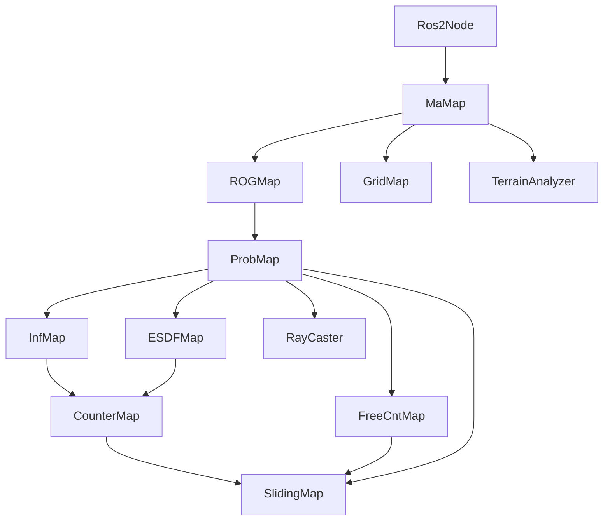
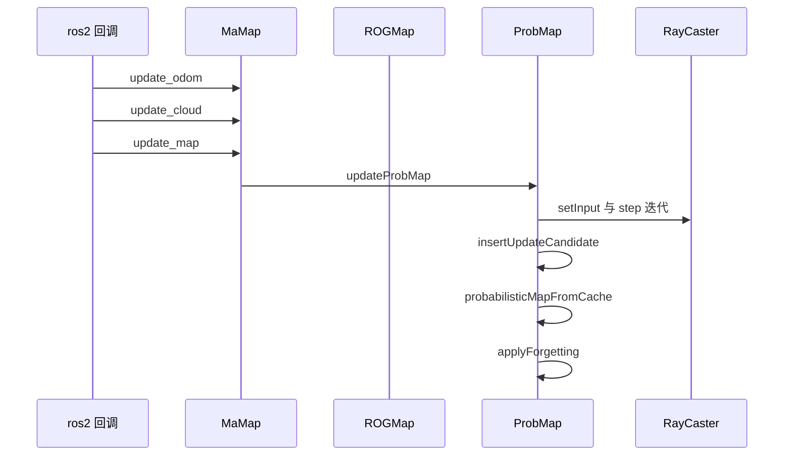
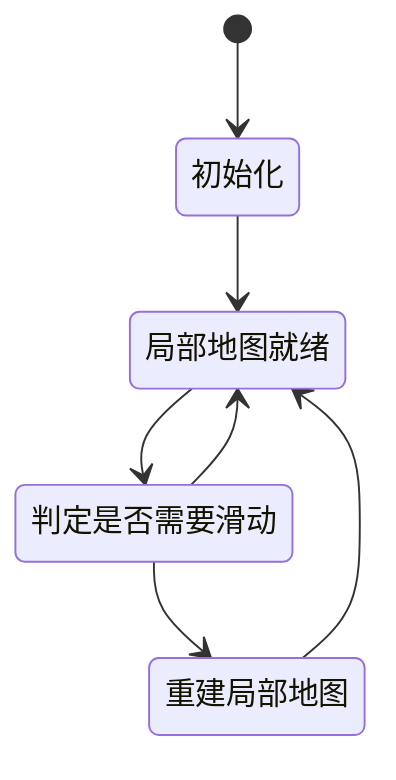
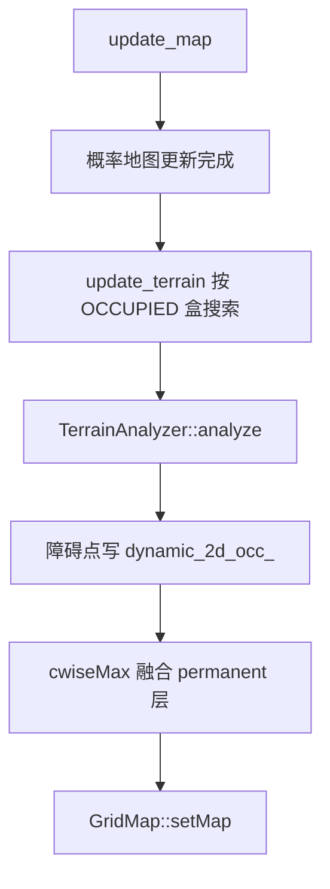
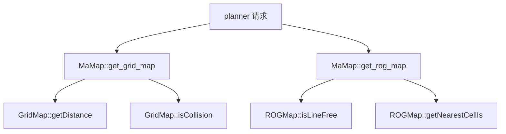

# map 模块 流程图（Mermaid）

## 模块总览

| 节点 | 对应符号 | 锚点 |
|---|---|---|
| Ros2Node | 构造并驱动 `MaMap` 的 ROS2 节点 | `src/ros2/src/ros2_node.cpp:33` |
| MaMap | `ma_map::MaMap` | `src/map/include/map/ma_map.hpp:10` |
| ROGMap | `rog_map::ROGMap` | `src/map/include/map/3d_occ_map/rog_map.h:38` |
| ProbMap | `rog_map::ProbMap` | `src/map/include/map/3d_occ_map/prob_map.h:35` |
| SlidingMap | `rog_map::SlidingMap` | `src/map/include/map/3d_occ_map/sliding_map.h:43` |
| CounterMap | `rog_map::CounterMap` | `src/map/include/map/3d_occ_map/counter_map.h:33` |
| InfMap | `rog_map::InfMap` | `src/map/include/map/3d_occ_map/inf_map.h:31` |
| ESDFMap | `rog_map::ESDFMap` | `src/map/include/map/3d_occ_map/esdf_map.h:35` |
| FreeCntMap | `rog_map::FreeCntMap` | `src/map/include/map/3d_occ_map/free_cnt_map.h:34` |
| RayCaster | `rog_map::raycaster::RayCaster` | `src/map/include/map/3d_occ_map/raycaster.h:55` |
| GridMap | `grid_map::GridMap` | `src/map/include/map/grid_map.hpp:38` |
| TerrainAnalyzer | `Terrain::TerrainAnalyzer` | `src/map/include/map/terrain_analysis.hpp:15` |

## 3D 概率地图更新时序

| 步骤 | 对应符号 | 锚点 |
|---|---|---|
| `update_odom` | 位姿入口 | `src/map/include/map/ma_map.hpp:99` |
| `update_cloud` | 点云入口（含里程计新鲜度检查） | `src/map/include/map/ma_map.hpp:102` |
| `update_map` | 更新调度入口 | `src/map/include/map/ma_map.hpp:50` |
| `updateRobotState` | 记录机器人状态与接收时间 | `src/map/include/map/3d_occ_map/rog_map.h:140` |
| `updateProbMap` | 概率更新主流程 | `src/map/include/map/3d_occ_map/prob_map.h:109` |
| `setInput` | 射线投射准备 | `src/map/include/map/3d_occ_map/raycaster.h:72` |
| `step` | 逐体素推进 | `src/map/include/map/3d_occ_map/raycaster.h:74` |
| `insertUpdateCandidate` | 累积待更新体素 | `src/map/include/map/3d_occ_map/prob_map.h:188` |
| `probabilisticMapFromCache` | 达批量阈值后统一写回 | `src/map/include/map/3d_occ_map/prob_map.h:180` |
| `applyForgetting` | 遗忘衰减 | `src/map/include/map/3d_occ_map/prob_map.h:194` |

## 滑窗状态机

| 状态 / 迁移 | 对应符号 | 锚点 |
|---|---|---|
| 初始化 | `initSlidingMap` | `src/map/include/map/3d_occ_map/sliding_map.h:58` |
| 判定是否需要滑动 | `mapSliding` | `src/map/include/map/3d_occ_map/sliding_map.h:66` |
| 重建局部地图 | 更新原点与边界 | `src/map/include/map/3d_occ_map/sliding_map.h:134` |
| 单格重置 | `resetCell`（纯虚，派生类实现） | `src/map/include/map/3d_occ_map/sliding_map.h:101` |
| 越界内存清理 | `clearMemoryOutOfMap` | `src/map/include/map/3d_occ_map/sliding_map.h:103` |

## 2D 栅格与通过性

| 节点 | 对应符号 | 锚点 |
|---|---|---|
| A | `ma_map::MaMap::update_map` | `src/map/include/map/ma_map.hpp:50` |
| C | `rog_map::ProbMap::boxSearch` | `src/map/include/map/3d_occ_map/prob_map.h:75` |
| D | `Terrain::TerrainAnalyzer::analyze` | `src/map/include/map/terrain_analysis.hpp:35` |
| E | 动态层按索引置 1 | `src/map/include/map/ma_map.hpp:91` |
| F | 动态层与永久层逐元素取最大 | `src/map/include/map/ma_map.hpp:94` |
| G | `grid_map::GridMap::setMap` | `src/map/include/map/grid_map.hpp:68` |

## 查询链路（planner 视角）

| 节点 | 对应符号 | 锚点 |
|---|---|---|
| B | `ma_map::MaMap::get_grid_map` | `src/map/include/map/ma_map.hpp:124` |
| C | `ma_map::MaMap::get_rog_map` | `src/map/include/map/ma_map.hpp:130` |
| D | `grid_map::GridMap::getDistance` | `src/map/include/map/grid_map.hpp:69` |
| E | `grid_map::GridMap::isCollision` | `src/map/include/map/grid_map.hpp:71` |
| F | `rog_map::ROGMap::isLineFree` | `src/map/include/map/3d_occ_map/rog_map.h:59` |
| G | `rog_map::ROGMap::getNearestCellIs` | `src/map/include/map/3d_occ_map/rog_map.h:81` |
