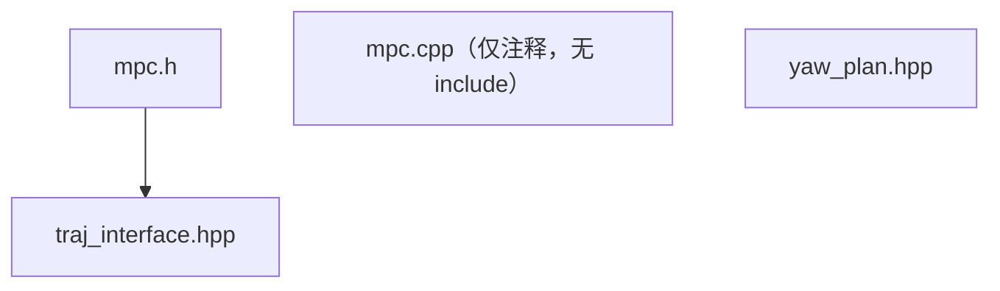

# controller 模块 依赖关系

## CMake target 与链接依赖

| 项 | 值 | 锚点 |
|---|---|---|
| 工程名 / 库名 | `controller` | `src/planner/controller/CMakeLists.txt:3` |
| 源文件收集 | `file(GLOB_RECURSE sources CONFIGURE_DEPENDS "src/*.cpp")` | `src/planner/controller/CMakeLists.txt:8` |
| target 类型 | 库（`add_library`） | `src/planner/controller/CMakeLists.txt:12` |
| sources | `target_sources(... PRIVATE ${sources})` | `src/planner/controller/CMakeLists.txt:14` |
| include 可见性 | `target_include_directories(... PUBLIC include)` | `src/planner/controller/CMakeLists.txt:16` |
| 链接可见性 | 默认（未写作用域，等价 PUBLIC） | `src/planner/controller/CMakeLists.txt:20` |
| 构建顺序 | 位于 traj_optimize 之后、replan/ros2 之前 | `CMakeLists.txt:69-72` |
| 顶层可执行 | ma_nav 链接本库 | `CMakeLists.txt:91` |

【事实】`GLOB_RECURSE` 只收集 `src/*.cpp`，而本模块唯一的 .cpp 是空实现
（`src/planner/controller/src/mpc.cpp:1`），因此本模块编译期几乎不产出目标代码，
实现全部以模板形式在使用方（ros2）实例化。

【事实】CMakeLists 里没有写链接作用域关键字
（`src/planner/controller/CMakeLists.txt:20`），
按 CMake 语义等价于 `PUBLIC`：本模块的全部 include 目录会传递给下游。

## 外部库依赖

| 库 | 用途 | 证据 |
|---|---|---|
| `Eigen3::Eigen` | 稠密/稀疏矩阵与 QP 数据 | `src/planner/controller/CMakeLists.txt:24` |
| `osqp::osqp` | QP 求解器本体 | `src/planner/controller/CMakeLists.txt:25` |
| `OsqpEigen::OsqpEigen` | OSQP 的 Eigen 封装（本模块直接使用） | `src/planner/controller/CMakeLists.txt:26` |
| `spdlog::spdlog` | 日志后端（经 utils 的 logger 使用） | `src/planner/controller/CMakeLists.txt:21` |
| `utils` | 日志通道 | `src/planner/controller/CMakeLists.txt:22` |

【事实】`libqpOASES.a` 被链接（`src/planner/controller/CMakeLists.txt:23`），
但本模块源码中**没有任何 qpOASES 引用**；它可能是历史遗留或为其它目标准备的。

【事实】本模块**不使用** yaml-cpp、PCL、rclcpp（`src/planner/controller/include/controller/mpc.h:3-8`）。

## 模块内依赖

| 依赖方 | 被依赖 | 锚点 |
|---|---|---|
| `mpc.h` | `traj_interface.hpp` | `src/planner/controller/include/controller/mpc.h:6` |
| `mpc.h` | Eigen 稠密 / 稀疏 / OsqpEigen | `src/planner/controller/include/controller/mpc.h:3-5` |
| `traj_interface.hpp` | traj_optimize 的主优化器头（取输出类型） | `src/planner/controller/include/controller/traj_interface.hpp:4` |

【事实】`yaw_plan.hpp` 不依赖模块内任何头，也不被任何文件 include
（`src/planner/controller/include/controller/yaw_plan.hpp:1`），
是一个尚未接入的独立骨架。

## 跨模块依赖

### controller 依赖谁

| 被依赖模块 | 依赖点 | 锚点 |
|---|---|---|
| traj_optimize | 轨迹输出类型（样条与时间段） | `src/planner/controller/include/controller/traj_interface.hpp:4` |
| utils | 日志通道（**隐式**：mpc.h 未直接 include） | `src/planner/controller/include/controller/mpc.h:6` |
| map | 无直接依赖（样条求值由 traj_optimize 提供） | `src/planner/controller/CMakeLists.txt:20-29` |

### 谁依赖 controller

| 依赖方 | 依赖点 | 锚点 |
|---|---|---|
| ros2 | 以 `Mpc<MaSplineTrajectoryInterface>` 作为成员 | `src/ros2/include/ros2/ros2_node.h:146` |
| ros2 | 装载 MPC 参数 | `src/ros2/include/ros2/config.hpp:272` |
| ros2 | CMake 链接 | `src/ros2/CMakeLists.txt:46` |
| planner/replan | CMake 链接（源码中无任何 include 或符号引用） | `src/planner/replan/CMakeLists.txt:18` |

【待确认】planner/replan 只链接、不 include 本模块（`src/planner/replan/CMakeLists.txt:18`），
在 `src/planner/replan` 下检索不到任何 controller 头引用；
这条链接是否是多余的，需要作者确认。

## 依赖风险

| # | 风险 | 说明 | 锚点 | 类型 |
|---|---|---|---|---|
| 1 | 日志依赖是隐式的 | mpc.h 调用日志但不 include utils 的 logger 头，靠 `traj_interface.hpp → traj_optimizer.h → optimizer_config.h` 传递；上游头一旦去掉该 include，本模块立刻编译失败 | `src/planner/controller/include/controller/mpc.h:6` | 【事实】 |
| 2 | 链接了未使用的求解器 | qpOASES 被链接但源码零引用，属于无效依赖 | `src/planner/controller/CMakeLists.txt:23` | 【事实】 |
| 3 | 链接无作用域关键字 | 未写 PRIVATE/PUBLIC 会让 Eigen/OSQP 的 include 目录外传给所有下游 | `src/planner/controller/CMakeLists.txt:20` | 【事实】 |
| 4 | replan 侧的悬空链接 | replan 链接本库但不使用，增加无谓的构建依赖 | `src/planner/replan/CMakeLists.txt:18` | 【待确认】 |
| 5 | 维度常量两处定义 | 控制器侧与轨迹接口侧各有一套同名同值常量，任一处改动可能静默不一致 | `src/planner/controller/include/controller/traj_interface.hpp:15-16` | 【事实】 |
| 6 | 本模块实现全在模板里 | 下游（ros2）实例化时才编译，接口错误在下游暴露 | `src/planner/controller/include/controller/mpc.h:41` | 【事实】 |
