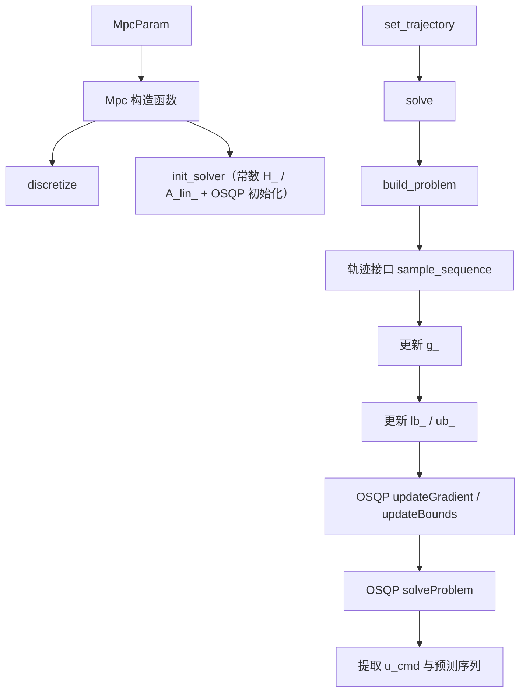
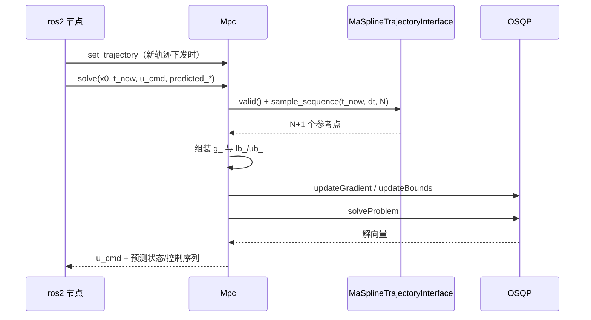
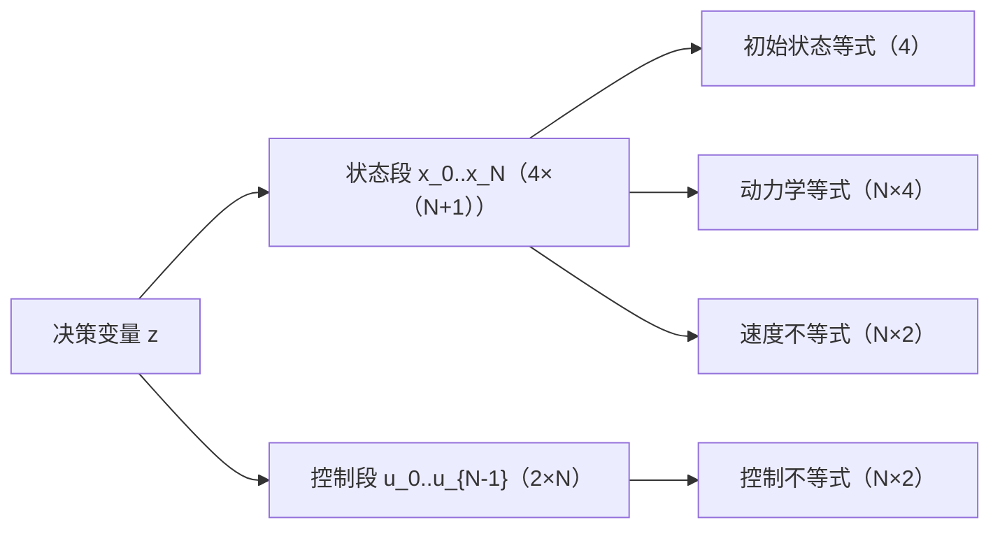
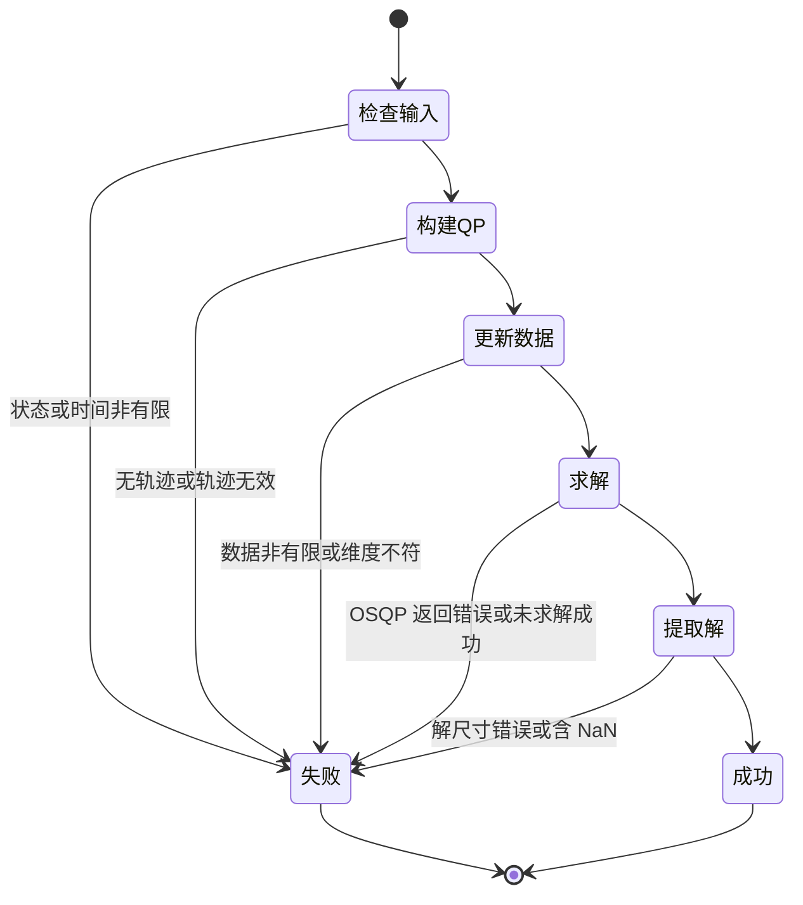

# controller 模块 流程图（Mermaid）

> 每个节点都对应真实符号；节点表逐条给出锚点。

## 主数据流

| 节点 | 对应符号 | 锚点 |
|---|---|---|
| A | `control::MpcParam` | `src/planner/controller/include/controller/mpc.h:15` |
| B | 构造函数：先离散化再初始化求解器 | `src/planner/controller/include/controller/mpc.h:91-97` |
| C | `control::Mpc::discretize` | `src/planner/controller/include/controller/mpc.h:120` |
| D | `control::Mpc::init_solver` | `src/planner/controller/include/controller/mpc.h:148` |
| E | `control::Mpc::set_trajectory` | `src/planner/controller/include/controller/mpc.h:48` |
| F | `control::Mpc::solve`（对外两个重载） | `src/planner/controller/include/controller/mpc.h:50-58` |
| G | `control::Mpc::build_problem` | `src/planner/controller/include/controller/mpc.h:63` |
| H | 轨迹接口的批量采样 | `src/planner/controller/include/controller/traj_interface.hpp:50` |
| I | 参考状态/控制 → 线性项 | `src/planner/controller/include/controller/mpc.h:321-334` |
| J | 初始状态、动力学、速度与控制边界 | `src/planner/controller/include/controller/mpc.h:339-380` |
| K | OSQP 数据更新 | `src/planner/controller/include/controller/mpc.h:450` |
| L | OSQP 求解与状态判定 | `src/planner/controller/include/controller/mpc.h:456-467` |
| M | 取第一段控制作为指令 | `src/planner/controller/include/controller/mpc.h:490-502` |

【事实】决策变量的布局是先全部状态、后全部控制：
`z = [x_0 … x_N, u_0 … u_{N-1}]`，因此「当前控制量」是解向量中偏移
`nx*(N+1)` 处的第一段
（`src/planner/controller/include/controller/mpc.h:139`、`src/planner/controller/include/controller/mpc.h:490`）。

## 单帧求解时序

| 步骤 | 对应符号 | 锚点 |
|---|---|---|
| 轨迹注入 | 只在有新轨迹时调用 | `src/ros2/src/ros2_node.cpp:313` |
| 每帧调用 | 传入当前状态与时间 | `src/ros2/src/ros2_node.cpp:179` |
| 前置检查 | 状态与时间必须有限 | `src/planner/controller/include/controller/mpc.h:408-411` |
| 参考采样 | 采样数量不足即判失败 | `src/planner/controller/include/controller/mpc.h:311-316` |
| QP 数据自检 | 有限性、维度、上下界一致性 | `src/planner/controller/include/controller/mpc.h:420-447` |
| 解的自检 | 尺寸、有限性、逐段有限性 | `src/planner/controller/include/controller/mpc.h:472-522` |

## QP 结构

| 组成 | 计算方式 | 锚点 |
|---|---|---|
| 变量数 | 状态 4×(N+1) + 控制 2×N | `src/planner/controller/include/controller/mpc.h:156` |
| 约束数 | 4 + N×4 + N×2 + N×2 | `src/planner/controller/include/controller/mpc.h:159-162` |
| Hessian | 常数：状态权重 + 控制权重 + 控制增量权重 | `src/planner/controller/include/controller/mpc.h:176-210` |
| 线性约束矩阵 | 常数：等式与不等式两部分的系数 | `src/planner/controller/include/controller/mpc.h:215-274` |
| OSQP 设置 | 关闭输出、开启热启动 | `src/planner/controller/include/controller/mpc.h:279-280` |

【推断】把 Hessian 与约束矩阵做成常数的前提是「权重与限幅不随时间变化」；
本模块的参数在构造后确实不再更新，因此该前提成立
（依据：`src/planner/controller/include/controller/mpc.h:91-97`、`src/planner/controller/include/controller/mpc.h:294-297`）。

## 失败分支

| 分支 | 判据 | 锚点 |
|---|---|---|
| 输入非法 | 状态或时间非有限 | `src/planner/controller/include/controller/mpc.h:408-411` |
| 无可用轨迹 | 轨迹指针为空或接口判定无效 | `src/planner/controller/include/controller/mpc.h:299-301` |
| QP 数据非法 | 梯度/上下界非有限、维度不符、下界大于上界 | `src/planner/controller/include/controller/mpc.h:420-447` |
| 求解失败 | OSQP 返回错误，或状态既非精确解也非不精确解 | `src/planner/controller/include/controller/mpc.h:457-467` |
| 解非法 | 解尺寸不符或含非有限值 | `src/planner/controller/include/controller/mpc.h:472-522` |

【事实】所有失败分支都返回布尔假并写日志，不会抛出异常；
调用方在失败时跳过本帧指令
（`src/ros2/src/ros2_node.cpp:179-189`）。
