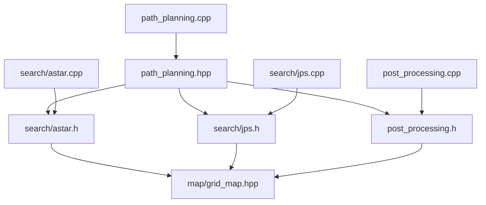

# path_planning 模块 依赖关系

## CMake target 与链接依赖

| 项 | 值 | 锚点 |
|---|---|---|
| 工程名 / 库名 | `path_planning` | `src/planner/path_planning/CMakeLists.txt:3` |
| 源文件收集 | `file(GLOB_RECURSE sources CONFIGURE_DEPENDS "src/*.cpp")` | `src/planner/path_planning/CMakeLists.txt:5` |
| target 类型 | 库（`add_library`） | `src/planner/path_planning/CMakeLists.txt:7` |
| sources | `target_sources(... PRIVATE ${sources})` | `src/planner/path_planning/CMakeLists.txt:9` |
| include 可见性 | `target_include_directories(... PUBLIC include)` | `src/planner/path_planning/CMakeLists.txt:11` |
| 构建顺序 | 位于 map 之后、traj_optimize/controller/replan 之前 | `CMakeLists.txt:66-72` |
| 顶层可执行 | ma_nav 公开链接本库 | `CMakeLists.txt:90` |

【事实】链接可见性是 `PUBLIC`（`src/planner/path_planning/CMakeLists.txt:13-18`），
因此 `Eigen3::Eigen` 与 `3d_occ_map` 的 include 目录会经本库**传递给所有下游**
（依赖方无需重复写 Eigen 的 find_package）。

## 外部库依赖

| 库 | 用途 | 证据 |
|---|---|---|
| `spdlog::spdlog` | 日志后端（本模块只经 utils 的 logger 使用） | `src/planner/path_planning/CMakeLists.txt:14` |
| `utils` | 日志与计时段（模块内唯一的功能性依赖） | `src/planner/path_planning/CMakeLists.txt:15` |
| `Eigen3::Eigen` | 向量/矩阵与轨迹数据结构 | `src/planner/path_planning/CMakeLists.txt:16` |
| `3d_occ_map` | 提供栅格图与 ESDF 查询接口 | `src/planner/path_planning/CMakeLists.txt:17` |

【事实】本模块**没有** yaml-cpp、PCL、rclcpp、OSQP 依赖
（`src/planner/path_planning/CMakeLists.txt:13-18` 是完整的链接列表）。

## 模块内依赖

| 依赖方 | 被依赖 | 锚点 |
|---|---|---|
| `path_planning.hpp` | `search/astar.h` / `search/jps.h` / `post_processing.h` | `src/planner/path_planning/include/path_planning/path_planning.hpp:3-5` |
| `path_planning.hpp` | `utils/logger.hpp` | `src/planner/path_planning/include/path_planning/path_planning.hpp:2` |
| `path_planning.cpp` | 门面头文件 | `src/planner/path_planning/src/path_planning.cpp:1` |
| `astar.cpp` | `search/astar.h` | `src/planner/path_planning/src/search/astar.cpp:1` |
| `jps.cpp` | `search/jps.h` | `src/planner/path_planning/src/search/jps.cpp:1` |
| `post_processing.cpp` | `post_processing.h` | `src/planner/path_planning/src/post_processing.cpp:1` |

【事实】模块内依赖是单向的：两个搜索头文件互不 include，后处理也不 include 搜索头
（`src/planner/path_planning/include/path_planning/post_processing.h:2-4`），
三者只被门面聚合（`src/planner/path_planning/src/path_planning.cpp:66-69`）。

## 跨模块依赖

### path_planning 依赖谁

| 被依赖模块 | 依赖点 | 锚点 |
|---|---|---|
| map | `map/grid_map.hpp`（后处理的碰撞与隧道查询） | `src/planner/path_planning/include/path_planning/post_processing.h:2` |
| map | `map/grid_map.hpp`（A*） | `src/planner/path_planning/include/path_planning/search/astar.h:28` |
| map | `map/grid_map.hpp`（JPS） | `src/planner/path_planning/include/path_planning/search/jps.h:3` |
| utils | `utils/scope_timer.hpp`（声明在 A* 头中） | `src/planner/path_planning/include/path_planning/search/astar.h:27` |
| utils | `utils/logger.hpp`（搜索失败日志） | `src/planner/path_planning/src/search/astar.cpp:2` |
| utils | `utils/logger.hpp`（JPS 超时/失败诊断） | `src/planner/path_planning/src/search/jps.cpp:2` |
| utils | 日志通道 `path_planning` 在 utils 侧定义 | `src/utils/include/utils/logger.hpp:121` |

【事实】模块实际用到的地图接口只有距离场与几何换算：
图内判定、ESDF 距离、栅格数、原点、分辨率、坐标↔索引、隧道语义
（`src/planner/path_planning/src/search/jps.cpp:23-28`、`src/planner/path_planning/src/post_processing.cpp:438`）。

### 谁依赖 path_planning

| 依赖方 | 依赖点 | 锚点 |
|---|---|---|
| planner/replan | 持有门面对象并调用规划 | `src/planner/replan/include/replan/fsm_replanner.h:97` |
| planner/replan | 直接 include `path_planning/path_planning.hpp` 与 `path_planning/post_processing.h` | `src/planner/replan/include/replan/fsm_replanner.h:3-8` |
| planner/replan | CMake 链接 | `src/planner/replan/CMakeLists.txt:16` |
| planner/traj_optimize | include 后处理头以读取 `Trajectory` | `src/planner/traj_optimize/include/traj_optimize/ma_spline_opt/optimizer_config.h:3` |
| planner/traj_optimize | 轨迹转换函数消费 `Trajectory` | `src/planner/traj_optimize/include/traj_optimize/ma_spline_opt/optimizer_config.h:108` |
| planner/traj_optimize | CMake 链接 | `src/planner/traj_optimize/CMakeLists.txt:17` |
| ros2 | 装载参数结构体 | `src/ros2/include/ros2/config.hpp:229` |
| ros2 | CMake 链接 | `src/ros2/CMakeLists.txt:45` |
| planner/controller | CMake 链接（源码中未直接使用本模块符号） | `src/planner/controller/CMakeLists.txt:28` |

【推断】planner/controller 只链接而不 include，说明它依赖的是本模块经
`traj_optimize` 传递来的类型/头路径；若要下线该链接，需要先确认
controller 侧没有隐式使用本模块的类型。

## 依赖风险

| # | 风险 | 说明 | 锚点 | 类型 |
|---|---|---|---|---|
| 1 | 无循环依赖 | 模块内 include 图有向无环：搜索头不反向 include 后处理头 | `src/planner/path_planning/include/path_planning/post_processing.h:2-4` | 【事实】 |
| 2 | `PUBLIC` 链接把 Eigen 与地图库外传 | 下游模块被动继承本模块的 include 目录，删除链接会连带影响下游编译 | `src/planner/path_planning/CMakeLists.txt:13-18` | 【事实】 |
| 3 | 参数结构体由**上层**（ros2）装载、定义在**本模块** | 方向相反：ros2 依赖本模块的头，本模块不依赖 ros2；参数契约的 owner 需要明确 | `src/ros2/include/ros2/config.hpp:229` | 【事实】 |
| 4 | 计时段头文件由 A* 头传递进来 | A* 自身不使用计时功能，但 `utils/scope_timer.hpp` 只经 A* 头引入；门面实现正是靠这条链拿到计时器，删除该 include 会连带编译失败 | `src/planner/path_planning/include/path_planning/search/astar.h:27` | 【事实】 |
| 5 | 轨迹结构的跨模块字段约定无编译期保护 | 下游读取 timed_trajectory、total_time、起终点位姿与起终速度（start_state / final_state）；其余字段（time_segments、weighted_length、if_cut、UnOccupied_*）只写不读，保留与否没有静态约束 | `src/planner/traj_optimize/include/traj_optimize/ma_spline_opt/optimizer_config.h:108-148` | 【推断】 |
| 6 | 比赛链路下 A* 是否仍被使用未确认 | 两处调用都传 JPS，A* 头与实现仍参与编译 | `src/planner/replan/src/fsm_replanner.cpp:69` | 【待确认】 |
