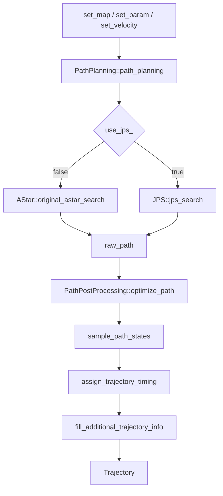
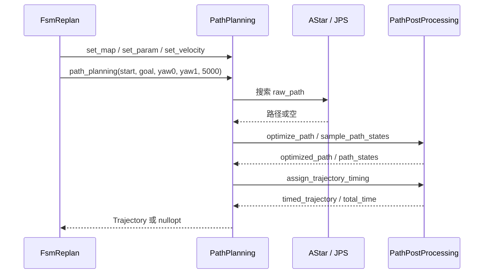
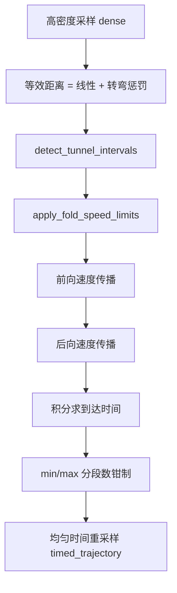
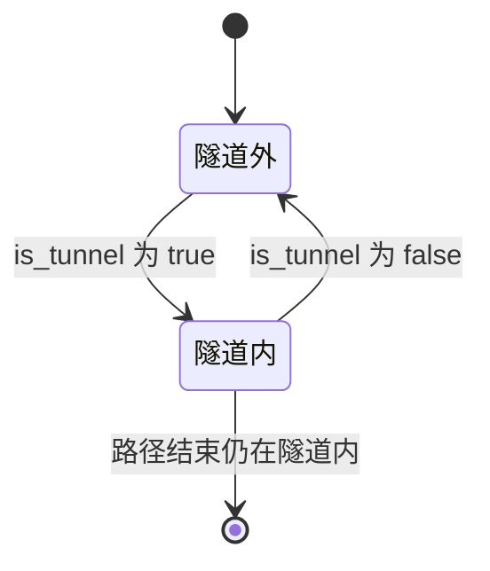

# path_planning 模块 流程图（Mermaid）

> 每个节点都对应真实符号，节点下的锚点表逐条给出证据来源。

## 主数据流

| 节点 | 对应符号 | 锚点 |
|---|---|---|
| A | 三个注入接口（地图/参数/速度） | `src/planner/path_planning/include/path_planning/path_planning.hpp:25-27` |
| B | `path_planning::PathPlanning::path_planning` | `src/planner/path_planning/include/path_planning/path_planning.hpp:31` |
| C | `path_planning::PathPlanningImpl::use_jps_` | `src/planner/path_planning/src/path_planning.cpp:68` |
| D | `path_planning::AStar::original_astar_search` | `src/planner/path_planning/src/search/astar.cpp:14` |
| E | `path_planning::JPS::jps_search` | `src/planner/path_planning/src/search/jps.cpp:192` |
| F | `path_planning::PathPostProcessing::Trajectory::raw_path` | `src/planner/path_planning/include/path_planning/post_processing.h:45` |
| G | `path_planning::PathPostProcessing::optimize_path` | `src/planner/path_planning/src/post_processing.cpp:4` |
| H | `path_planning::PathPostProcessing::sample_path_states` | `src/planner/path_planning/src/post_processing.cpp:89` |
| I | `path_planning::PathPostProcessing::assign_trajectory_timing` | `src/planner/path_planning/src/post_processing.cpp:121` |
| J | `path_planning::PathPostProcessing::fill_additional_trajectory_info` | `src/planner/path_planning/src/post_processing.cpp:308` |
| K | `path_planning::PathPostProcessing::Trajectory` | `src/planner/path_planning/include/path_planning/post_processing.h:44` |

【事实】搜索失败在两条路径上都以「返回空 vector」表达，随后被统一转成
`std::nullopt`（`src/planner/path_planning/src/path_planning.cpp:44-46`）。

## 时序图（调用方 ↔ 本模块）

| 步骤 | 对应符号 | 锚点 |
|---|---|---|
| 参数注入 | `FsmReplan` 把参数结构体交给门面 | `src/planner/replan/include/replan/fsm_replanner.h:45` |
| 发起规划 | 超时参数固定 5000 ms | `src/planner/replan/src/fsm_replanner.cpp:74` |
| 选择搜索器 | 三元表达式二选一 | `src/planner/path_planning/src/path_planning.cpp:41-42` |
| 后处理链 | 剪枝 → 采样 → 计时 | `src/planner/path_planning/src/path_planning.cpp:48-54` |
| 有效性闸门 | 空轨迹或无有效时间则丢弃 | `src/planner/path_planning/src/path_planning.cpp:58-61` |

## 时间分配子流程

| 步骤 | 对应符号 | 锚点 |
|---|---|---|
| 高密度细分 | 细分步数由采样间距决定 | `src/planner/path_planning/src/post_processing.cpp:172` |
| 等效距离 | 线性距离叠加转弯惩罚 | `src/planner/path_planning/src/post_processing.cpp:188` |
| 隧道区间 | 先扫描区间再据此限速 | `src/planner/path_planning/src/post_processing.cpp:217-219` |
| 前后向传播 | 用加速度能力双向收敛速度上限 | `src/planner/path_planning/src/post_processing.cpp:224-237` |
| 积分时间 | 用平均速度递推到达时间 | `src/planner/path_planning/src/post_processing.cpp:242-249` |
| 分段钳制 | 段数被夹在最小/最大值之间 | `src/planner/path_planning/src/post_processing.cpp:259-262` |
| 重采样 | 按均匀时间插值生成 `timed_trajectory` | `src/planner/path_planning/src/post_processing.cpp:271-305` |

【推断】折叠限速必须与前后向传播配合才能形成**可行**的减速剖面：
限速先把入口点压低，反向传播再据此把入口前的各点逐点压下去，
使减速需求不超过 max_acc；若把限速放在两次传播之后，
入口点会变慢而入口前的点不会被重新收敛，出现超出加速度能力的减速需求
（依据：`src/planner/path_planning/src/post_processing.cpp:210-219`）。

## 状态机（隧道区间扫描）

模块内唯一的显式状态机在 `detect_tunnel_intervals`：只有「隧道内 / 隧道外」两态，
用布尔量 `inside` 表示（`src/planner/path_planning/src/post_processing.cpp:434`）。

| 状态/迁移 | 对应符号 | 锚点 |
|---|---|---|
| 进入隧道 | 记录入口下标与等效里程 | `src/planner/path_planning/src/post_processing.cpp:440-445` |
| 离开隧道 | 记录出口下标与等效里程并收尾 | `src/planner/path_planning/src/post_processing.cpp:447-453` |
| 终点仍在隧道内 | 用最后一个采样点闭合区间 | `src/planner/path_planning/src/post_processing.cpp:456-461` |

【待确认】`is_tunnel` 依赖地图的 TUNNEL 语义层（Semantics 枚举），
若地图从未设置语义，本状态机将永远停留在「隧道外」，
即折叠降速不会生效（`src/map/include/map/grid_map.hpp:140-145`）。
