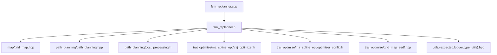

# replan 模块 依赖关系

## CMake target 与链接依赖

| 项 | 值 | 锚点 |
|---|---|---|
| 工程名 / 库名 | `replan` | `src/planner/replan/CMakeLists.txt:3` |
| 源文件收集 | `file(GLOB_RECURSE sources CONFIGURE_DEPENDS "src/*.cpp")` | `src/planner/replan/CMakeLists.txt:5` |
| target 类型 | 库（`add_library`） | `src/planner/replan/CMakeLists.txt:7` |
| sources | `target_sources(... PRIVATE ${sources})` | `src/planner/replan/CMakeLists.txt:9` |
| include 可见性 | `target_include_directories(... PUBLIC include)` | `src/planner/replan/CMakeLists.txt:11` |
| 链接可见性 | `PRIVATE` | `src/planner/replan/CMakeLists.txt:13` |
| 构建顺序 | 位于 controller 之后、ros2 之前 | `CMakeLists.txt:70-72` |
| 顶层可执行 | ma_nav 链接本库 | `CMakeLists.txt:93` |

## 外部库依赖

| 库 | 用途 | 证据 |
|---|---|---|
| `utils` | 日志、计时、状态类型、期望值工具 | `src/planner/replan/CMakeLists.txt:14` |
| `Eigen3::Eigen` | 向量与矩阵 | `src/planner/replan/CMakeLists.txt:15` |
| `path_planning` | 栅格搜索与后处理门面 | `src/planner/replan/CMakeLists.txt:16` |
| `traj_optimize` | MINCO 优化器与地图适配器 | `src/planner/replan/CMakeLists.txt:17` |
| `controller` | **仅链接、源码零引用** | `src/planner/replan/CMakeLists.txt:18` |

【事实】本模块**不链接** spdlog、yaml-cpp、PCL、rclcpp、OSQP：
日志经 utils 使用，参数由 ros2 侧装载
（`src/planner/replan/CMakeLists.txt:13-19`）。

## 模块内依赖

| 依赖方 | 被依赖 | 锚点 |
|---|---|---|
| `fsm_replanner.cpp` | 自身头文件 | `src/planner/replan/src/fsm_replanner.cpp:1` |
| `fsm_replanner.cpp` | 期望值工具与日志 | `src/planner/replan/src/fsm_replanner.cpp:2-4` |

【事实】模块只有一个实现文件，声明与实现之间没有额外的中间层
（`src/planner/replan/src/fsm_replanner.cpp:1`）。

## 跨模块依赖

### replan 依赖谁

| 被依赖模块 | 依赖点 | 锚点 |
|---|---|---|
| map | 栅格地图（距离查询、内外判定、梯度） | `src/planner/replan/include/replan/fsm_replanner.h:2` |
| path_planning | 搜索门面与后处理轨迹类型 | `src/planner/replan/include/replan/fsm_replanner.h:3` |
| path_planning | 后处理参数结构（安全距离、采样分辨率） | `src/planner/replan/include/replan/fsm_replanner.h:8` |
| traj_optimize | MINCO 优化器与上游轨迹转换 | `src/planner/replan/include/replan/fsm_replanner.h:5` |
| traj_optimize | 优化参数结构与地图适配器 | `src/planner/replan/include/replan/fsm_replanner.h:4-6` |
| utils | 期望值、日志、机器人状态类型 | `src/planner/replan/include/replan/fsm_replanner.h:9-11` |

【事实】本模块是 planner 链路的**汇聚点**：同时依赖搜索（path_planning）、
优化（traj_optimize）、地图（map）与工具（utils），
也是唯一同时 include 这三者的模块
（`src/planner/replan/include/replan/fsm_replanner.h:2-11`）。

### 谁依赖 replan

| 依赖方 | 依赖点 | 锚点 |
|---|---|---|
| ros2 | include 门面头并作为节点成员 | `src/ros2/include/ros2/ros2_node.h:13` |
| ros2 | 以 `FsmReplan::PathState` 作为导航状态类型 | `src/ros2/include/ros2/ros2_node.h:106` |
| ros2 | 每帧调用规划入口 | `src/ros2/src/ros2_node.cpp:272` |
| ros2 | CMake 链接 | `src/ros2/CMakeLists.txt:48` |

【事实】源码中唯一使用本模块的是 ros2；
其余模块（controller、traj_optimize、path_planning）都不依赖 replan
（`src/ros2/include/ros2/ros2_node.h:13`、`src/ros2/include/ros2/config.hpp:3`、`src/ros2/src/ros2_node.cpp:5` 三处 include 印证）。

## 依赖风险

| # | 风险 | 说明 | 锚点 | 类型 |
|---|---|---|---|---|
| 1 | 悬空的 controller 链接 | 本模块链接了 controller，但源码零引用，属无谓构建依赖 | `src/planner/replan/CMakeLists.txt:18` | 【事实】 |
| 2 | 依赖三组参数结构 | 重规划、优化、搜索后处理三类参数都要在构造/注入时给全，缺一组就会用默认或不确定值 | `src/planner/replan/include/replan/fsm_replanner.h:35-39` | 【事实】 |
| 3 | 门面对两个子模块封装很薄 | 参数直接透传、调用顺序写死在 `plan()` 里，子模块接口变化会直接穿透到本模块 | `src/planner/replan/src/fsm_replanner.cpp:60-100` | 【事实】 |
| 4 | 地图适配器是局部对象 | 优化器只保存裸指针，依赖「同函数内先注入再使用」的顺序 | `src/planner/replan/src/fsm_replanner.cpp:92-93`、`src/planner/traj_optimize/include/traj_optimize/ma_spline_opt/traj_optimizer.h:29-31` | 【事实】 |
| 5 | 未使用时序/热启动参数 | 三个已装载的参数没有读取点，热启动能力实际未接入 | `src/planner/replan/include/replan/fsm_replanner.h:26-33` | 【事实】 |
| 6 | 无重试退避 | 规划失败后标志保持为真，失败会每帧重试 | `src/planner/replan/src/fsm_replanner.cpp:76-79` | 【事实】 |
