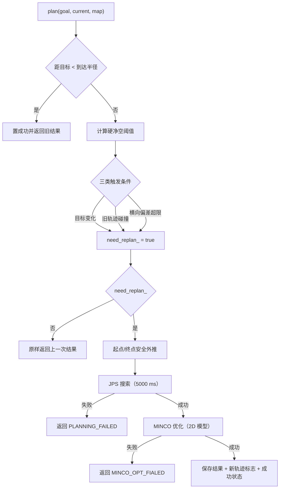
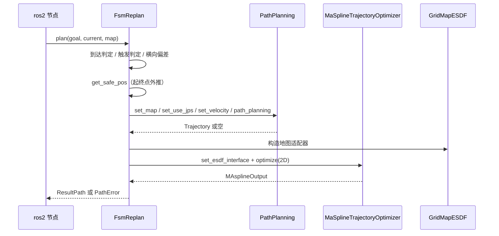
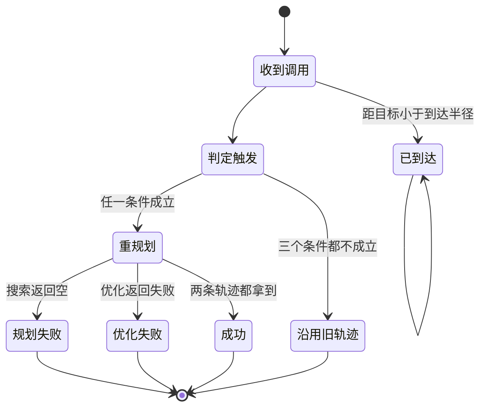

# replan 模块 流程图（Mermaid）

> 每个节点都对应真实符号；节点表逐条给出锚点。

## 主数据流

| 节点 | 对应符号 | 锚点 |
|---|---|---|
| A | `replan::FsmReplan::plan` | `src/planner/replan/include/replan/fsm_replanner.h:83` |
| B | 到达判定（早退） | `src/planner/replan/src/fsm_replanner.cpp:21-25` |
| D | 硬净空阈值 | `src/planner/replan/src/fsm_replanner.cpp:32-33` |
| E | 三类触发条件 | `src/planner/replan/src/fsm_replanner.cpp:35-56` |
| I | `replan::FsmReplan::get_safe_pos` | `src/planner/replan/src/fsm_replanner.cpp:237` |
| J | 搜索调用（固定 JPS + 5000 ms） | `src/planner/replan/src/fsm_replanner.cpp:69-74` |
| K | 规划失败错误 | `src/planner/replan/src/fsm_replanner.cpp:76-80` |
| L | 优化调用（固定 2D 模型） | `src/planner/replan/src/fsm_replanner.cpp:97-100` |
| M | 优化失败错误 | `src/planner/replan/src/fsm_replanner.cpp:101-104` |
| N | 成功收尾 | `src/planner/replan/src/fsm_replanner.cpp:105-110` |

【事实】触发条件之间是「或」：一旦任一条件成立就把重规划标志置真，
而标志只在一次**成功**的重规划末尾被清掉
（`src/planner/replan/src/fsm_replanner.cpp:109`）。

## 触发判定细化

| 条件 | 判据 | 锚点 |
|---|---|---|
| 目标变化 | 目标相对上次成功目标在任一轴上的绝对差超阈值 | `src/planner/replan/src/fsm_replanner.cpp:35-39` |
| 旧轨迹碰撞 | 优化航点为空，或折线复检发现不安全点 | `src/planner/replan/src/fsm_replanner.cpp:41-46` |
| 横向偏差 | 当前点到参考折线的最短距离超阈值 | `src/planner/replan/src/fsm_replanner.cpp:49-56` |
| 参考折线来源 | 优先用上次优化路径，缺省用结果里的优化路径 | `src/planner/replan/src/fsm_replanner.cpp:51` |

【待确认】目标变化的比较基准是成员里保存的「上次成功目标」，
它没有初始化器（`src/planner/replan/include/replan/fsm_replanner.h:64`），
首次调用时该比较读到的是未初始化内容（详见 [待确认清单](./待确认清单.md)）。

## 重规划时序

| 步骤 | 对应符号 | 锚点 |
|---|---|---|
| 参数注入 | 节点构造后一次性注入 | `src/ros2/src/ros2_node.cpp:36` |
| 每帧调用 | 传入目标、当前状态与地图 | `src/ros2/src/ros2_node.cpp:272` |
| 搜索注入 | 地图、算法选择、速度 | `src/planner/replan/src/fsm_replanner.cpp:60-72` |
| 优化注入 | 适配器 + 上游轨迹转换 + 模型 | `src/planner/replan/src/fsm_replanner.cpp:92-97` |
| 结果消费 | 只有成功且是新轨迹才下发给控制器 | `src/ros2/src/ros2_node.cpp:308-313` |

【事实】错误只以两种枚举值向上传播：规划失败与优化失败
（`src/planner/replan/include/replan/fsm_replanner.h:76-80`）；
调用方收到错误后按 20 s 超时决定是否把导航状态置为失败
（`src/ros2/src/ros2_node.cpp:273-279`）。

## 失败分支

| 状态/迁移 | 对应符号 | 锚点 |
|---|---|---|
| 已到达 | 置成功状态并返回（不规划） | `src/planner/replan/src/fsm_replanner.cpp:21-25` |
| 沿用旧轨迹 | 直接返回上一次的结果结构 | `src/planner/replan/src/fsm_replanner.cpp:112` |
| 规划失败 | 记录警告、保持重规划标志、返回错误 | `src/planner/replan/src/fsm_replanner.cpp:76-80` |
| 优化失败 | 记录信息日志并返回错误 | `src/planner/replan/src/fsm_replanner.cpp:101-104` |
| 成功 | 置新轨迹标志与成功状态、记录目标、清标志 | `src/planner/replan/src/fsm_replanner.cpp:105-110` |

【事实】优化失败分支**没有**按注释承诺回退到原始轨迹：
它直接返回错误，调用方丢弃结果并不发布轨迹
（`src/planner/replan/src/fsm_replanner.cpp:83` 与 `src/planner/replan/src/fsm_replanner.cpp:101-104` 对照）。
