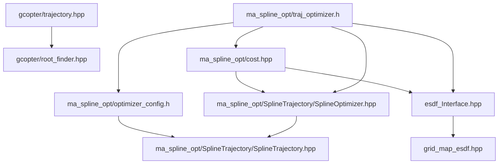

# traj_optimize 模块 依赖关系

## CMake target 与链接依赖

| 项 | 值 | 锚点 |
|---|---|---|
| 工程名 / 库名 | `traj_optimize` | `src/planner/traj_optimize/CMakeLists.txt:3` |
| 源文件收集 | `file(GLOB_RECURSE sources CONFIGURE_DEPENDS "src/*.cpp")` | `src/planner/traj_optimize/CMakeLists.txt:5` |
| target 类型 | 库（`add_library`） | `src/planner/traj_optimize/CMakeLists.txt:7` |
| sources | `target_sources(... PRIVATE ${sources})` | `src/planner/traj_optimize/CMakeLists.txt:9` |
| include 可见性 | `target_include_directories(... PUBLIC include)` | `src/planner/traj_optimize/CMakeLists.txt:11` |
| 链接可见性 | `PRIVATE`（spdlog / Eigen3 / utils / path_planning） | `src/planner/traj_optimize/CMakeLists.txt:13-17` |
| 构建顺序 | 位于 path_planning 之后、controller/replan/ros2 之前 | `CMakeLists.txt:68-72` |
| 顶层可执行 | ma_nav 链接本库 | `CMakeLists.txt:92` |

【事实】`GLOB_RECURSE` 只收集 `src/*.cpp`，而本模块唯一（且为空实现）的 .cpp 是
`src/planner/traj_optimize/src/ma_spline_opt/traj_optimizer.cpp:1`，
因此**本模块编译期几乎不产出目标代码**，全部实现以模板形式在使用方实例化。

【事实】本模块**没有直接链接地图库**，但适配器头文件 include 了地图头
（`src/planner/traj_optimize/include/traj_optimize/grid_map_esdf.hpp:8`），
它之所以能编译，是因为 path_planning 以 `PUBLIC` 方式链接了 3d_occ_map
（`src/planner/path_planning/CMakeLists.txt:13-18`），include 目录经 path_planning 传递过来。
【推断】这条传递链是隐式的：若哪天 path_planning 把 3d_occ_map 改成 `PRIVATE`，
本模块会直接编译失败。

## 外部库依赖

| 库 | 用途 | 证据 |
|---|---|---|
| `Eigen3::Eigen` | 样条系数、矩阵分解、向量运算 | `src/planner/traj_optimize/CMakeLists.txt:15` |
| `spdlog::spdlog` | 日志后端（本模块经 utils 的 logger 使用） | `src/planner/traj_optimize/CMakeLists.txt:14` |
| `utils` | logger、L-BFGS、`expected` 兼容层 | `src/planner/traj_optimize/CMakeLists.txt:16` |
| `path_planning` | 上游轨迹类型的定义（输入转换） | `src/planner/traj_optimize/CMakeLists.txt:17` |

【事实】本模块**不使用** yaml-cpp、PCL、rclcpp、OSQP、qpOASES。

## 模块内依赖

| 依赖方 | 被依赖 | 锚点 |
|---|---|---|
| `ma_spline_opt/traj_optimizer.h` | `SplineTrajectory/SplineOptimizer.hpp` | `src/planner/traj_optimize/include/traj_optimize/ma_spline_opt/traj_optimizer.h:3` |
| `ma_spline_opt/traj_optimizer.h` | `optimizer_config.h` | `src/planner/traj_optimize/include/traj_optimize/ma_spline_opt/traj_optimizer.h:4` |
| `ma_spline_opt/traj_optimizer.h` | `cost.hpp` | `src/planner/traj_optimize/include/traj_optimize/ma_spline_opt/traj_optimizer.h:5` |
| `ma_spline_opt/traj_optimizer.h` | `esdf_Interface.hpp` | `src/planner/traj_optimize/include/traj_optimize/ma_spline_opt/traj_optimizer.h:6` |
| `ma_spline_opt/traj_optimizer.h` | utils 的 `expected` / `lbfgs` | `src/planner/traj_optimize/include/traj_optimize/ma_spline_opt/traj_optimizer.h:7-8` |
| `ma_spline_opt/cost.hpp` | `esdf_Interface.hpp` 与 `SplineOptimizer.hpp` | `src/planner/traj_optimize/include/traj_optimize/ma_spline_opt/cost.hpp:2-3` |
| `ma_spline_opt/optimizer_config.h` | `SplineTrajectory.hpp` | `src/planner/traj_optimize/include/traj_optimize/ma_spline_opt/optimizer_config.h:4` |
| `SplineOptimizer.hpp` | `SplineTrajectory.hpp` | `src/planner/traj_optimize/include/traj_optimize/ma_spline_opt/SplineTrajectory/SplineOptimizer.hpp:4` |
| `grid_map_esdf.hpp` | `esdf_Interface.hpp` | `src/planner/traj_optimize/include/traj_optimize/grid_map_esdf.hpp:9` |
| `gcopter/trajectory.hpp` | `gcopter/root_finder.hpp` | `src/planner/traj_optimize/include/traj_optimize/gcopter/trajectory.hpp:28` |

【事实】模块内依赖是单向的：样条表示（`SplineTrajectory.hpp`）不反向依赖优化器框架，
代价结构只依赖接口与框架，不依赖门面
（`src/planner/traj_optimize/include/traj_optimize/ma_spline_opt/cost.hpp:2-3`）。

## 跨模块依赖

### traj_optimize 依赖谁

| 被依赖模块 | 依赖点 | 锚点 |
|---|---|---|
| path_planning | 复用其轨迹结构做输入转换 | `src/planner/traj_optimize/include/traj_optimize/ma_spline_opt/optimizer_config.h:3` |
| map | 栅格距离场与隧道语义（经适配器） | `src/planner/traj_optimize/include/traj_optimize/grid_map_esdf.hpp:8` |
| utils | 日志通道 | `src/planner/traj_optimize/include/traj_optimize/ma_spline_opt/optimizer_config.h:5` |
| utils | L-BFGS 实现（`utils/lbfgs.hpp`，非 gcopter 副本） | `src/planner/traj_optimize/include/traj_optimize/ma_spline_opt/traj_optimizer.h:8` |

### 谁依赖 traj_optimize

| 依赖方 | 依赖点 | 锚点 |
|---|---|---|
| planner/replan | include 配置、主优化器、ESDF 适配器 | `src/planner/replan/include/replan/fsm_replanner.h:4-6` |
| planner/replan | CMake 链接 | `src/planner/replan/CMakeLists.txt:17` |
| planner/controller | 轨迹接口 include 主优化器头以取得输出类型 | `src/planner/controller/include/controller/traj_interface.hpp:4` |
| planner/controller | CMake 链接 | `src/planner/controller/CMakeLists.txt:27` |
| ros2 | 可视化头 include 样条类型与 gcopter 轨迹头 | `src/ros2/include/ros2/misc/visualizer.hpp:5-7` |
| ros2 | CMake 链接 | `src/ros2/CMakeLists.txt:47` |

【事实】replan、controller、ros2 三方都 include 本模块的**模板头**，
因此本模块的任何接口改动都会在这三处实例化并报错，而不是在库自身。

## 生效与停用的两套实现

模块自带说明给出了取舍（`src/planner/traj_optimize/include/traj_optimize/opt.md:1-4`），
并在全仓库 include 检索中得到印证：

| 分组 | 文件数 | 符号数 | 状态依据 |
|---|---|---|---|
| `ma_spline_opt/**` + 两个接口/适配器 + `gcopter/{trajectory,root_finder}.hpp` | 10 | 930 | 生效，被 replan / controller / ros2 直接 include |
| `spline_opt/**` | 4 | 798 | 停用（作者注明「后续更新用的代码」；全仓库无任何 include 指向它） |
| `gcopter/{minco,lbfgs,sdlp}.hpp` | 3 | 144 | 停用（作者注明「未使用」；全仓库无任何 include 指向它们） |

具体文件与锚点见 [README](./README.md) 的源文件清单
（`src/planner/traj_optimize/include/traj_optimize/opt.md:1-4`）。

【事实】符号数由 `docs/_evidence/traj_optimize/inventory.json` 统计（共 1872 条），
生效组的 `SplineTrajectory::SplineOptimizer`、`SplineTrajectory::QuinticSplineND`
等类型来自 `ma_spline_opt/SplineTrajectory/`
（`src/planner/traj_optimize/include/traj_optimize/ma_spline_opt/SplineTrajectory/SplineOptimizer.hpp:408`）。

## 依赖风险

| # | 风险 | 说明 | 锚点 | 类型 |
|---|---|---|---|---|
| 1 | 地图库依赖靠 path_planning 传递 | 本模块自己不链接 3d_occ_map，改变上游链接可见性会连带破坏本模块编译 | `src/planner/traj_optimize/include/traj_optimize/grid_map_esdf.hpp:8` | 【推断】 |
| 2 | 两套同名头并存 | 引用 `SplineTrajectory.hpp` 时必须靠目录区分，写错路径会实例化另一套实现 | `src/planner/traj_optimize/include/traj_optimize/spline_opt/SplineTrajectory/SplineTrajectory.hpp:1` | 【事实】 |
| 3 | 停用副本仍参与读者可见范围 | `spline_opt/` 与 `gcopter/{minco,lbfgs,sdlp}.hpp` 不在任何 include 链上，但仍是模块目录内容 | `src/planner/traj_optimize/include/traj_optimize/opt.md:1-4` | 【事实】 |
| 4 | gcopter 轨迹头与可视化重载的取舍 | 可视化头 include 了 gcopter 轨迹头，并有一个以它的 Trajectory 为形参、调用其接口的重载；但该重载没有调用点（唯一调用处已注释），模板从未实例化 | `src/ros2/include/ros2/misc/visualizer.hpp:349`、`src/planner/traj_optimize/include/traj_optimize/gcopter/trajectory.hpp:348` | 【待确认】 |
| 5 | 本模块改动影响面广 | 三个下游模块 include 模板头，接口变更会在下游实例化处报错 | `src/planner/controller/include/controller/traj_interface.hpp:4` | 【事实】 |
| 6 | L-BFGS 有两份实现 | 实际使用 utils 版本，模块内 `gcopter/lbfgs.hpp` 是历史副本，容易改错文件 | `src/planner/traj_optimize/include/traj_optimize/ma_spline_opt/traj_optimizer.h:8` | 【事实】 |
