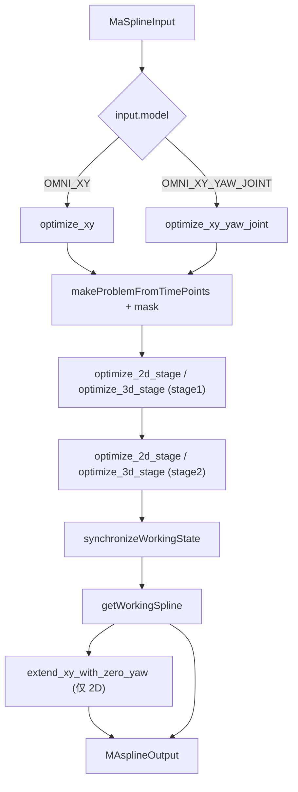
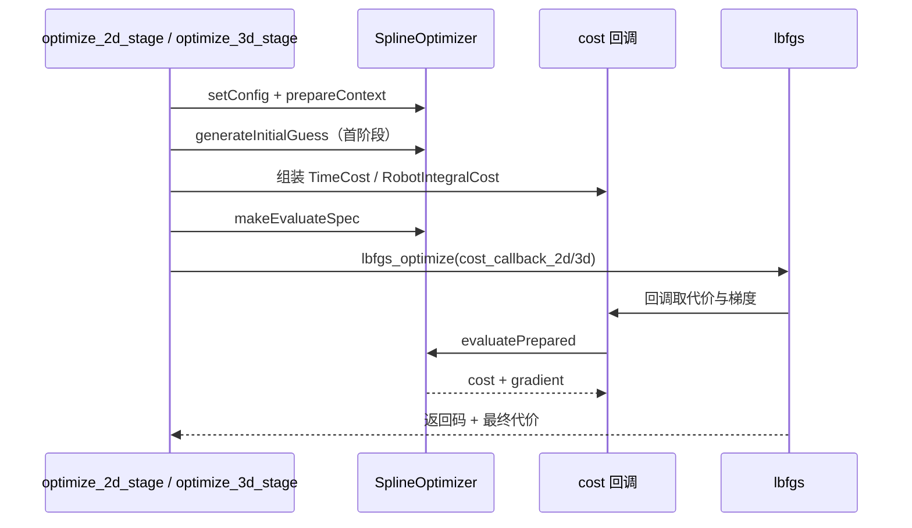
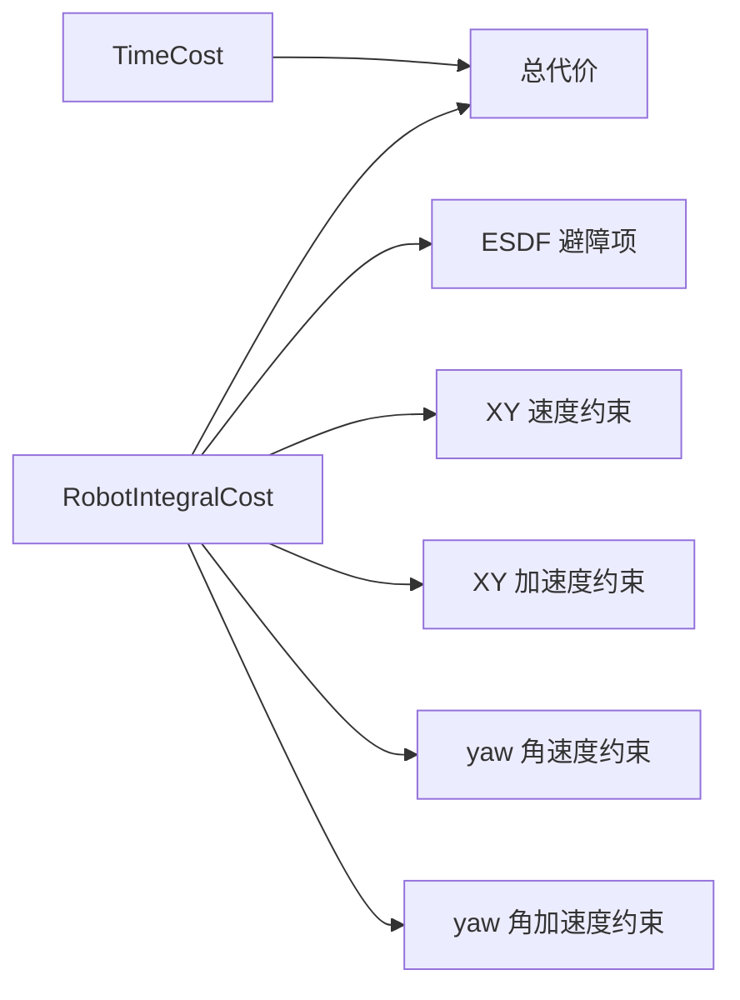
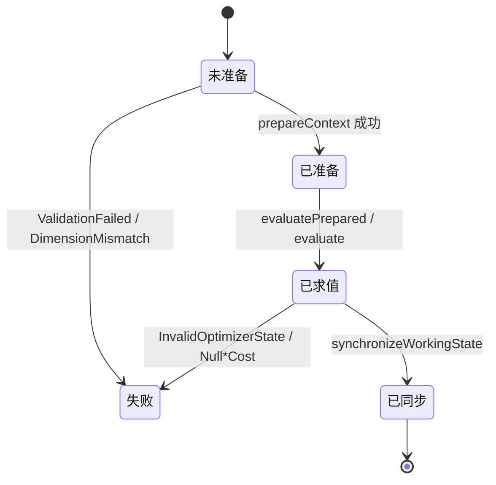

# traj_optimize 模块 流程图（Mermaid）

> 每个节点都对应真实符号；节点表逐条给出锚点。

## 主数据流

| 节点 | 对应符号 | 锚点 |
|---|---|---|
| A | `ma_spline_opt::MaSplineInput` | `src/planner/traj_optimize/include/traj_optimize/ma_spline_opt/optimizer_config.h:66` |
| B | 模型分派 switch | `src/planner/traj_optimize/include/traj_optimize/ma_spline_opt/traj_optimizer.h:165-193` |
| C | `ma_spline_opt::MaSplineTrajectoryOptimizer::optimize_xy` | `src/planner/traj_optimize/include/traj_optimize/ma_spline_opt/traj_optimizer.h:81` |
| D | `ma_spline_opt::MaSplineTrajectoryOptimizer::optimize_xy_yaw_joint` | `src/planner/traj_optimize/include/traj_optimize/ma_spline_opt/traj_optimizer.h:107` |
| E | 问题构造与首末点 mask | `src/planner/traj_optimize/include/traj_optimize/ma_spline_opt/traj_optimizer.h:225-231` |
| F | stage1 权重的那一次 L-BFGS | `src/planner/traj_optimize/include/traj_optimize/ma_spline_opt/traj_optimizer.h:235-238` |
| G | stage2 权重的那一次 L-BFGS（以 stage1 解为初值） | `src/planner/traj_optimize/include/traj_optimize/ma_spline_opt/traj_optimizer.h:240-244` |
| H | `SplineTrajectory::SplineOptimizer::synchronizeWorkingState` | `src/planner/traj_optimize/include/traj_optimize/ma_spline_opt/SplineTrajectory/SplineOptimizer.hpp:1786`、`src/planner/traj_optimize/include/traj_optimize/ma_spline_opt/SplineTrajectory/SplineOptimizerProtocols_zh.md:294-298` |
| I | 取出最终样条 | `src/planner/traj_optimize/include/traj_optimize/ma_spline_opt/traj_optimizer.h:252` |
| J | `ma_spline_opt::extend_xy_with_zero_yaw` | `src/planner/traj_optimize/include/traj_optimize/ma_spline_opt/traj_optimizer.h:120` |
| K | `ma_spline_opt::MAsplineOutput` | `src/planner/traj_optimize/include/traj_optimize/ma_spline_opt/optimizer_config.h:79` |

【事实】两条分支都先检查时间点数量并返回同一错误码，但只有 2D 分支会写日志；
所有失败码最终都被转成「成功标志为假」的输出
（`src/planner/traj_optimize/include/traj_optimize/ma_spline_opt/traj_optimizer.h:205-208`、
`src/planner/traj_optimize/include/traj_optimize/ma_spline_opt/traj_optimizer.h:417-419`）。

## 单阶段优化内部时序（L-BFGS ↔ 求值规格）

| 步骤 | 对应符号 | 锚点 |
|---|---|---|
| 配置与上下文准备 | 每次阶段调用都会重新 prepare | `src/planner/traj_optimize/include/traj_optimize/ma_spline_opt/traj_optimizer.h:269-277` |
| 初值生成 | 仅在决策向量为空时生成 | `src/planner/traj_optimize/include/traj_optimize/ma_spline_opt/traj_optimizer.h:278-282` |
| 代价组装 | 时间代价 + 积分代价（避障/速度/加速度）+ 并行步数 | `src/planner/traj_optimize/include/traj_optimize/ma_spline_opt/traj_optimizer.h:284-301` |
| L-BFGS 参数 | 迭代上限、梯度阈值、记忆规模、步长下限 | `src/planner/traj_optimize/include/traj_optimize/ma_spline_opt/traj_optimizer.h:304-310` |
| 回调 | 静态回调把 void* 还原成上下文与求值规格 | `src/planner/traj_optimize/include/traj_optimize/ma_spline_opt/traj_optimizer.h:66-69` |
| 成功判据 | 返回码非负 + 代价有限 + 决策向量有限 | `src/planner/traj_optimize/include/traj_optimize/ma_spline_opt/traj_optimizer.h:321` |

【推断】阶段函数每次都调用 `prepareContext` 重新准备上下文
（`src/planner/traj_optimize/include/traj_optimize/ma_spline_opt/traj_optimizer.h:274`），
而协议文档说明 `setConfig` 只影响**后续新准备**的上下文
（`src/planner/traj_optimize/include/traj_optimize/ma_spline_opt/SplineTrajectory/SplineOptimizerProtocols_zh.md:233-234`），
因此「先 setConfig、再 prepareContext」这个顺序是必要的，不能反过来。

## 代价构成

| 代价项 | 对应符号 | 锚点 |
|---|---|---|
| 总时间 | 线性时间项 | `src/planner/traj_optimize/include/traj_optimize/ma_spline_opt/cost.hpp:174-176` |
| 最小时间 | 低于阈值时的二次罚 | `src/planner/traj_optimize/include/traj_optimize/ma_spline_opt/cost.hpp:178-185` |
| 时间均匀性 | 与均值的上下界比较 | `src/planner/traj_optimize/include/traj_optimize/ma_spline_opt/cost.hpp:187-222` |
| 避障 | 平滑 L1 违反量 + 正交投影梯度 | `src/planner/traj_optimize/include/traj_optimize/ma_spline_opt/cost.hpp:76-119` |
| XY 速度/加速度 | 平方速度与阈值之差 | `src/planner/traj_optimize/include/traj_optimize/ma_spline_opt/cost.hpp:122-133` |
| yaw 角速度/角加速度 | 取绝对值与阈值之差 | `src/planner/traj_optimize/include/traj_optimize/ma_spline_opt/cost.hpp:136-149` |

【事实】yaw 相关项只在 `DIM == 3` 时参与，XY 相关项在 `DIM >= 2` 时参与，
用 `if constexpr` 在编译期裁剪
（`src/planner/traj_optimize/include/traj_optimize/ma_spline_opt/cost.hpp:73-149`）。

## 状态与错误码

| 状态/迁移 | 对应符号 | 锚点 |
|---|---|---|
| 错误码集合 | `SplineTrajectory::SplineOptimizer::ErrorCode` | `src/planner/traj_optimize/include/traj_optimize/ma_spline_opt/SplineTrajectory/SplineOptimizer.hpp:502` |
| 结果基类 | 带 ok/code/message 的 `SplineTrajectory::SplineOptimizer::Status` | `src/planner/traj_optimize/include/traj_optimize/ma_spline_opt/SplineTrajectory/SplineOptimizer.hpp:526` |
| 求值结果 | 在基类上追加 cost | `src/planner/traj_optimize/include/traj_optimize/ma_spline_opt/SplineTrajectory/SplineOptimizer.hpp:530-533` |
| 上下文有效性 | `OptimizationContext` 自带有效性检查 | `src/planner/traj_optimize/include/traj_optimize/ma_spline_opt/SplineTrajectory/SplineOptimizer.hpp:766-773` |

【待确认】门面把三种业务失败压缩成一个布尔返回值，并没有透传框架的具体错误码
（`src/planner/traj_optimize/include/traj_optimize/ma_spline_opt/traj_optimizer.h:41-45`、
`src/planner/traj_optimize/include/traj_optimize/ma_spline_opt/traj_optimizer.h:275-277`），
因此「问题定义哪里不合法」在日志里看不到，需要作者确认是否要补日志。
